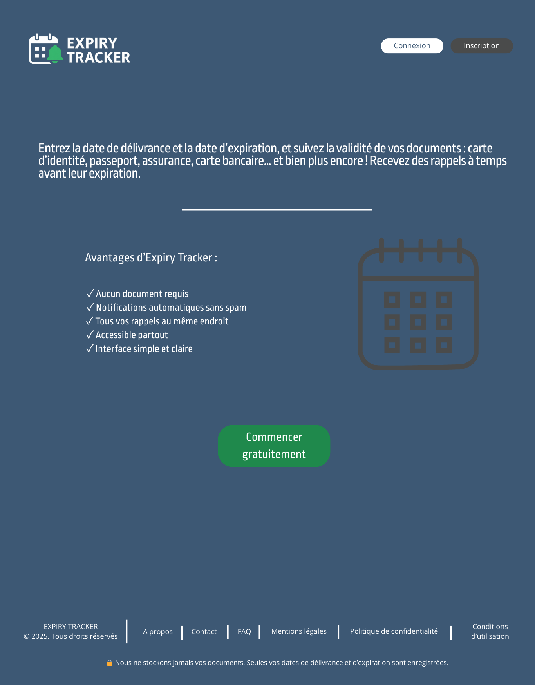
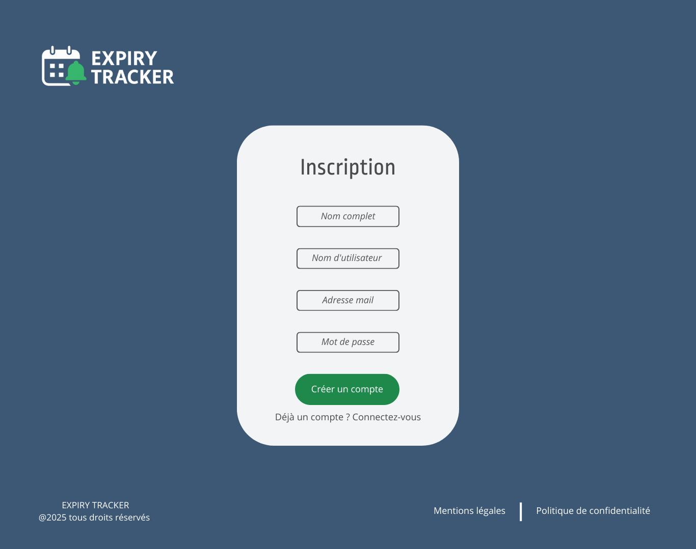
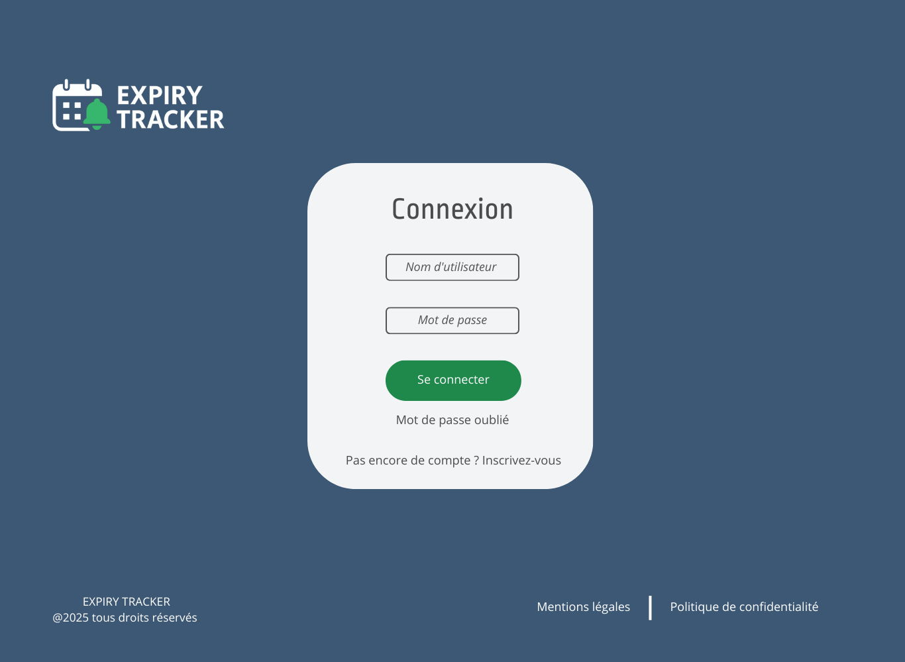
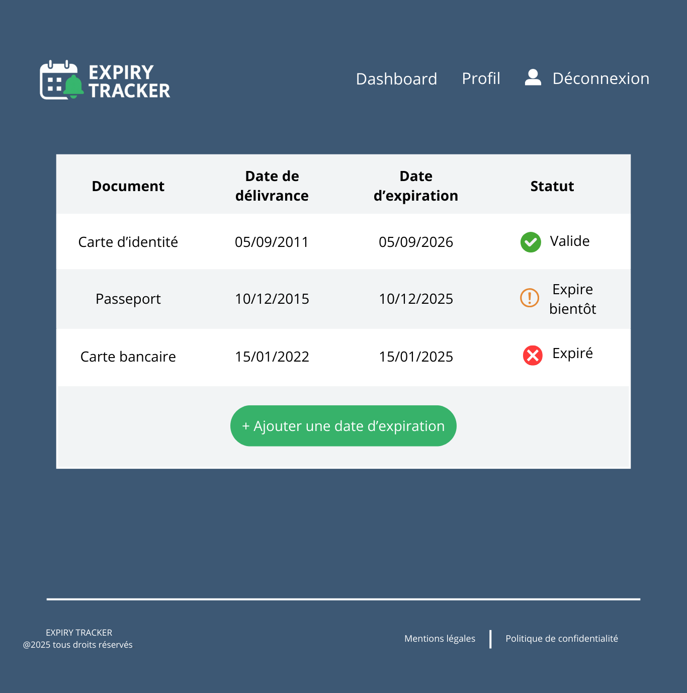
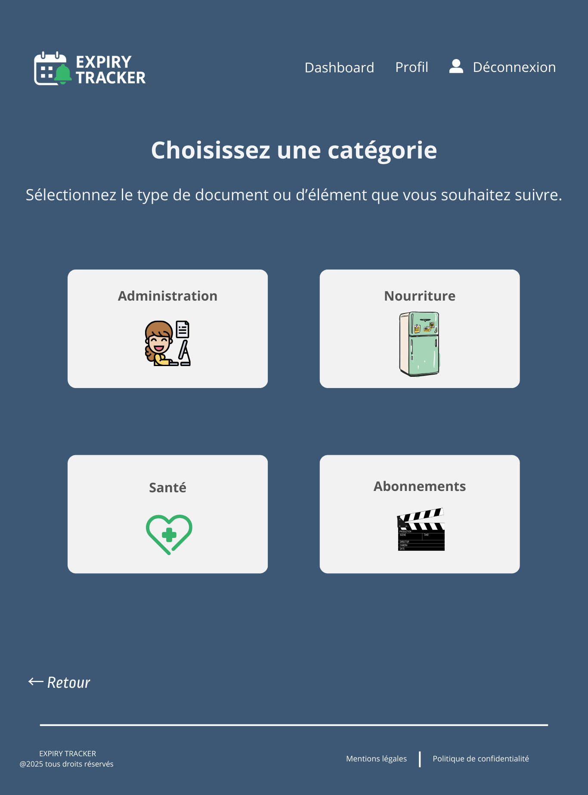
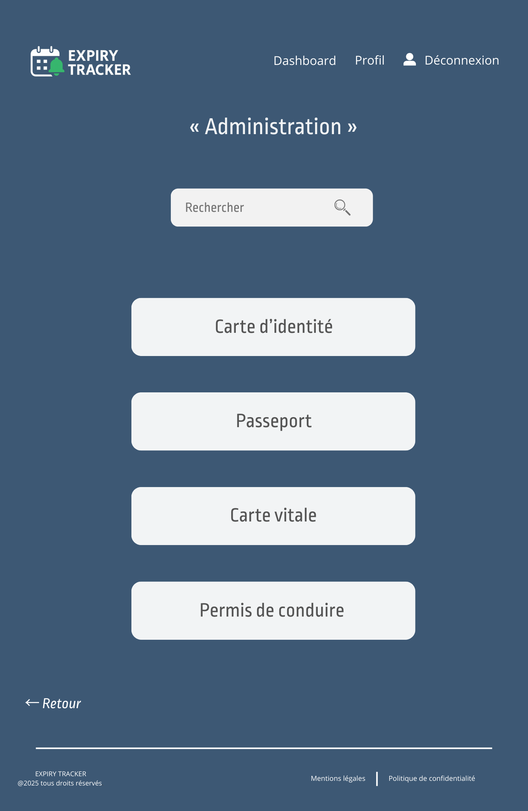
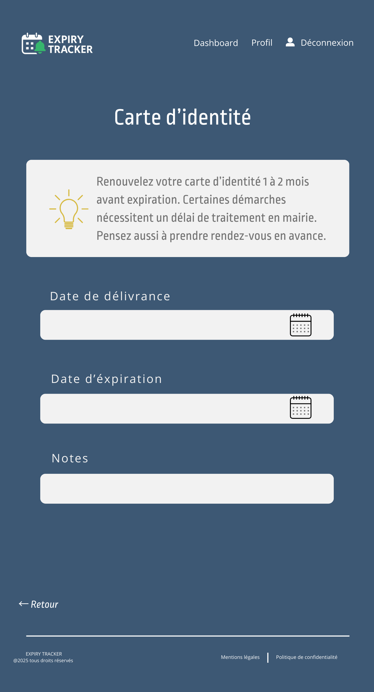

# Stage 3 – Technical Documentation

## 0. User Stories and Mockups

### User Stories (MoSCoW)

#### Must Have
- En tant qu’utilisateur, je veux **créer un compte**, afin de **sauvegarder mes dates d’expirations**.  
- En tant qu’utilisateur, je veux **me connecter**, afin d' **accéder à mon tableau de bord personnalisé**.  
- En tant qu’utilisateur, je veux **ajouter une date de délivrance et une date d’expiration**, afin de **suivre la validité de mes documents**.  
- En tant qu’utilisateur, je veux **voir une liste de mes documents avec leur statut (valide, expire bientôt, expiré)**, afin de **savoir lesquels je dois renouveler**.  
- En tant qu’utilisateur, je veux **choisir une catégorie (Administration, Nourriture, Santé, Abonnements, etc.)**, afin de **mieux organiser mes rappels**.  

#### Should Have
- En tant qu’utilisateur, je veux **rechercher un document dans une catégorie**, afin de **le retrouver rapidement**.  
- En tant qu’utilisateur, je veux **modifier ou supprimer un document**, afin de **garder mes informations à jour**.  
- En tant qu’utilisateur, je veux **recevoir des conseils spécifiques à chaque document (exemple : renouveler une carte d’identité 1 à 2 mois avant expiration)**, afin d' **anticiper mes démarches**.  

#### Could Have
- En tant qu’utilisateur, je veux **recevoir des rappels par email**, afin de **ne pas oublier mes échéances importantes**.  
- En tant qu’utilisateur, je veux **ajouter des notes personnalisées à mes documents**, afin de **mémoriser des informations complémentaires** (exemple : lieu de délivrance, numéro de dossier…).  
- En tant qu’utilisateur, je veux **personnaliser la fréquence de mes notifications** (par exemple 30 jours avant, 15 jours avant), afin de **recevoir mes rappels au bon moment**.  

#### Won’t Have
- En tant qu’utilisateur, je veux **une application mobile native (iOS/Android)**, afin d' **utiliser le service hors ligne**. *(Prévu éventuellement dans une version ultérieure)*  
- En tant qu’utilisateur, je veux **partager mes rappels avec d’autres personnes**, afin de **coordonner avec d'autres personnes**.  

###  Mockups

Le projet **Expiry Tracker** inclut une interface utilisateur (UI).  
Les mockups ont été réalisés avec **Canva** et exportés au format PNG.  

#### Page d’accueil (Landing page)

#### Page d’inscription

#### Page de connexion

#### Dashboard utilisateur

#### Choix des catégories

#### Administration (liste de documents)

#### Carte d’identité (détail avec conseils + formulaire)

## Livrable de la Tâche 0
- Liste des User Stories priorisées avec MoSCoW.  
- Mockups des écrans principaux (au format image, inclus dans le dossier `/mockups`).  

Ces éléments définissent le **parcours utilisateur** et serviront de base aux étapes suivantes :  
- Architecture (Tâche 1)  
- Base de données et classes (Tâche 2)  
- Diagrammes de séquence (Tâche 3)  
- Spécifications API (Tâche 4)  
- SCM & QA (Tâche 5)  
