# Stage 3 – Technical Documentation

## 0. User Stories and Mockups

### User Stories (MoSCoW)

#### Must Have
- As a user, I want to **create an account**, so that I can **save my expiration dates**.  
- As a user, I want to **log in**, so that I can **access my personalized dashboard**.  
- As a user, I want to **add an issue date and an expiration date**, so that I can **track the validity of my documents**.  
- As a user, I want to **see a list of my documents with their status (valid, expiring soon, expired)**, so that I can **know which ones I need to renew**.  
- As a user, I want to **choose a category (Administration, Food, Health, Subscriptions, etc.)**, so that I can **better organize my reminders**.  

#### Should Have
- As a user, I want to **search for a document in a category**, so that I can **find it quickly**.  
- As a user, I want to **edit or delete a document**, so that I can **keep my information up to date**.  
- As a user, I want to **receive specific tips for each document (e.g., renew an ID card 1–2 months before expiration)**, so that I can **anticipate the necessary steps**.  

#### Could Have
- As a user, I want to **receive reminders by email**, so that I can **avoid forgetting important deadlines**.  
- As a user, I want to **add personal notes to my documents**, so that I can **store additional information** (place of issue, file number…).  
- As a user, I want to **customize the frequency of my notifications** (30 days before, 15 days before), so that I can **receive reminders at the right time**.  

#### Won’t Have
- As a user, I want **a native mobile application (iOS/Android)**, so that I can **use the service offline**. *(Potentially planned for a later version)*  
- As a user, I want to **share my reminders with other people**, so that I can **coordinate with others**.  


### Mockups

The **Expiry Tracker** project includes a user interface (UI).  
Mockups were created with **Canva** and exported in PNG format.  

#### Landing Page
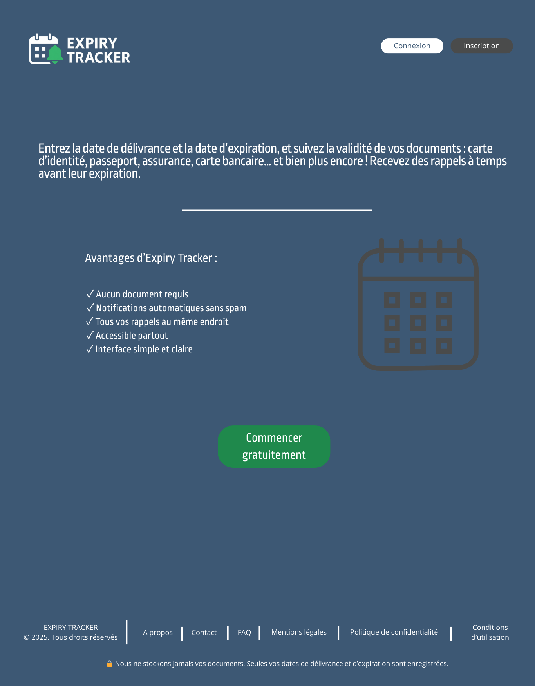

#### Registration Page
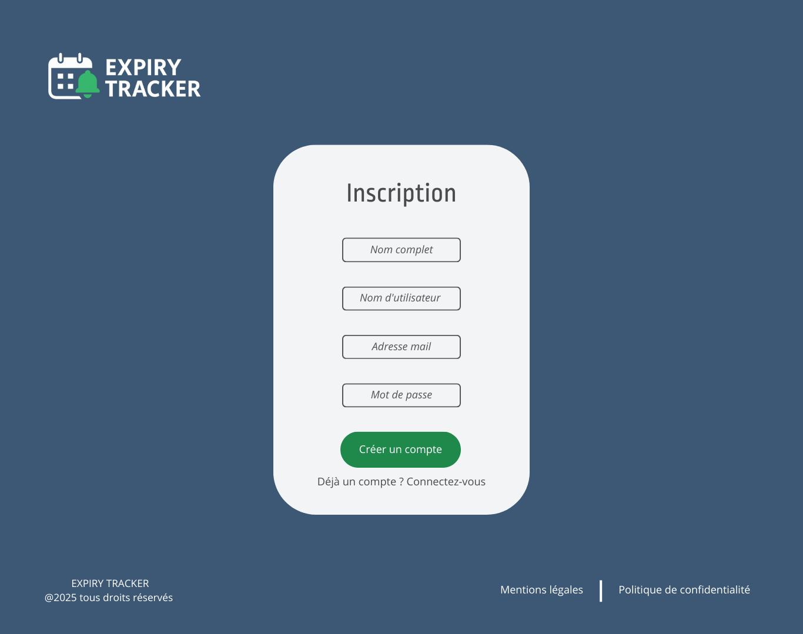

#### Login Page


#### User Dashboard
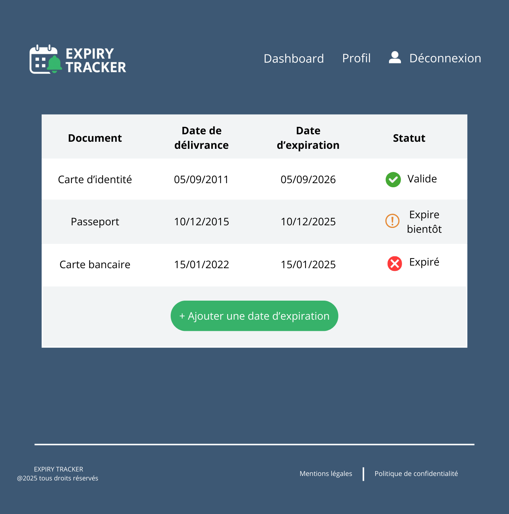

#### Category Selection
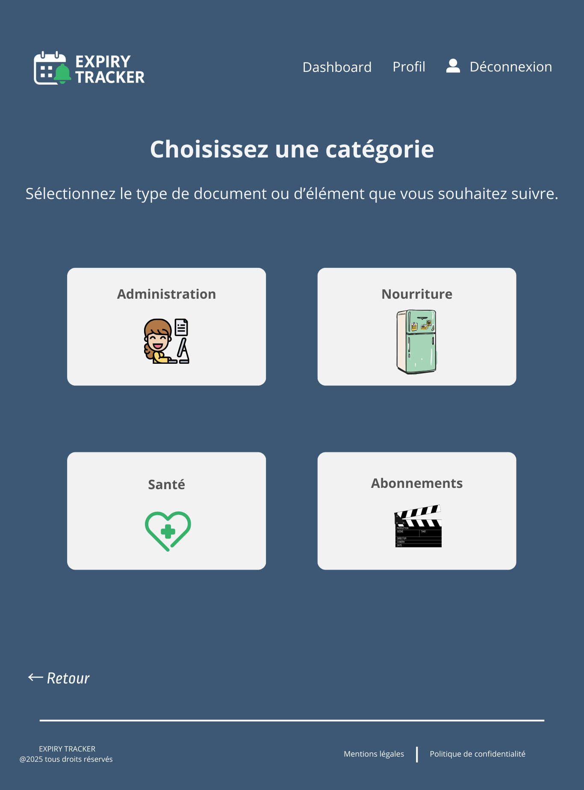

#### Administration (list of documents)
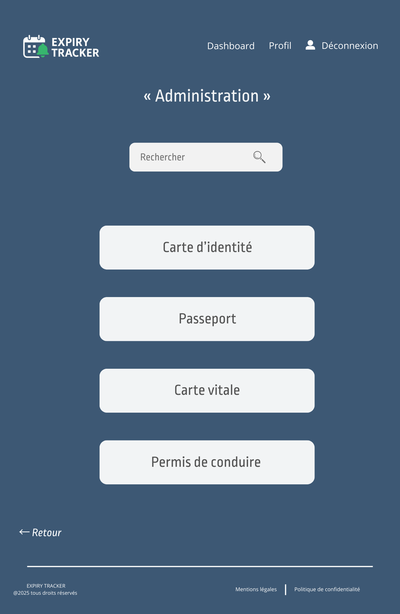

#### Identity Card (details with tips + form)
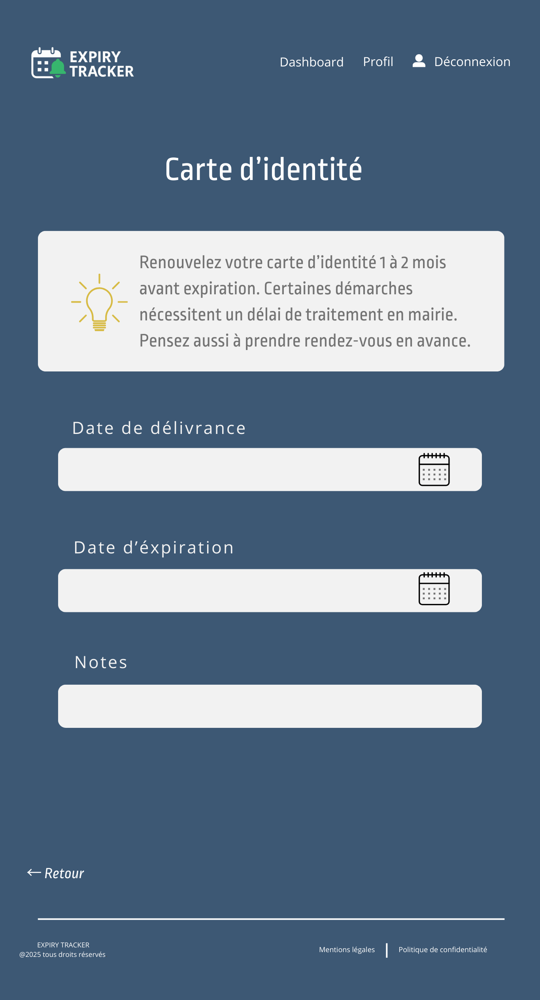
  

These elements define the **user journey** and will serve as the basis for the following stages:  
- Architecture (Task 1)  
- Database and Classes (Task 2)  
- Sequence Diagrams (Task 3)  
- API Specifications (Task 4)  
- SCM & QA (Task 5)


## Design System Architecture

### System Architecture Explanation

The architecture of the **Expiry Tracker** application is based on a **classic client-server model**, designed to be easy to maintain and scalable.  
It is composed of several main layers that work together to provide a smooth user experience.

---


### 1. Frontend – Web UI
The **Frontend Web UI** is the interface visible to the user, developed using **HTML, CSS, and JavaScript**.  
It contains the essential screens of the application:  

- Landing page  
- Registration  
- Login  
- Dashboard  
- Category selection  
- Document addition forms  

Its role is to allow the user to:  
- enter their information ( issue and expiration dates of a document),  
- view their reminders,  
- receive clear visual feedback on the status of their documents (valid, expiring soon, expired).  

The frontend does not act alone: it **communicates with the backend** through **HTTP requests (REST API)** using the **JSON** format.

---

### 2. Backend – API
The **Backend API** provides the **business logic** of the application.  
It is responsible for several key tasks:  

- Managing authentication and user security with **JWT tokens**.  
- Exposing **REST endpoints** to create, read, update, and delete documents. (CRUD)
- Applying business rules (calculating the status of documents based on their expiration dates).  

The backend is developed with a framework such as **Node.js/Express** and **Python/Flask**, ensuring fast and reliable communication between the user interface and the database.

---

### 3. Database – PostgreSQL
The **PostgreSQL database** securely stores all information in a **structured manner**.  
It includes three main tables:  

- **users**: user account information  
  - id  
  - name  
  - email  
  - hashed password  

- **documents**: tracked documents  
  - id  
  - type  
  - issue date  
  - expiration date  
  - associated user  

- **reminders**: automated reminders  
  - id  
  - document_id  
  - reminder date  
  - reminder status (sent or not)  

The choice of **PostgreSQL** is justified by:  
- its reliability,  
- its open-source and free nature,  
- its advanced relational features, perfectly suited for this type of application.

---

### 4. Complementary Services

Two additional services strengthen the system architecture and automate document tracking:  

- **Scheduler (Cron job)**: runs daily to check for documents approaching expiration and trigger reminders.  
- **External email service (SendGrid, Mailgun, etc.)**: securely and reliably sends notifications to users, without managing the email-sending infrastructure directly.

---

### 5. Separation of Concerns

This layered architecture ensures a clear separation of responsibilities:  

- **Frontend** → user experience.  
- **Backend** → business logic and security.  
- **Database** → data storage and consistency.  
- **External services** → automation and notifications.  

Thanks to this structure, the system is:  
- **robust**: each layer is independent,  
- **easy to maintain**: changes in one layer do not impact the whole system,  
- **scalable**: new features (SMS notifications, mobile app) can be added without rebuilding everything.

---


### Architecture Diagram

The diagram below illustrates how the components and services interact:  

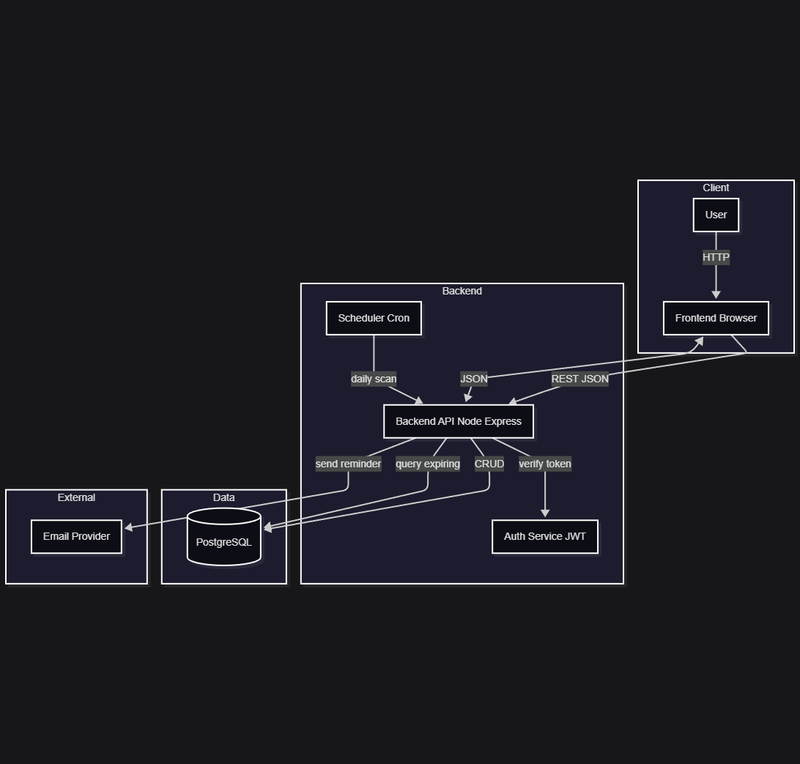

## Technical Documentation

## 2. Define Components, Classes, and Database Design

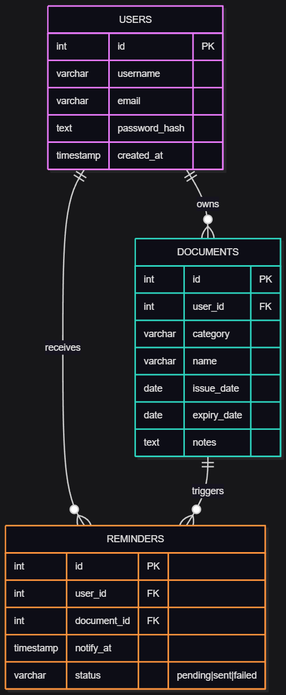

### 1. Main System Components

The **Expiry Tracker** application is organized into three main layers:  

- **Frontend (Web Interface)**  
  - Developed in HTML, CSS, and JavaScript.  
  - Role: provide the user interface allowing:  
	- user registration and login,  
	- access to the dashboard,  
	- adding and managing documents,  
	- viewing reminders and the status of documents (valid, expiring soon, expired).  

- **Backend (API)**  
  - Developed with Node.js + Express.  
  - Responsibilities:  
	- manage authentication (JWT),  
	- provide REST endpoints for CRUD operations,  
	- implement business logic (date and expiration status calculations),  
	- communicate with the database,  
	- trigger reminders via a scheduler.  

- **Database (PostgreSQL)**  
  - Stores users, documents, and reminders.  
  - A robust relational system that ensures data integrity and efficient date handling.  

- **External Services**  
  - Email provider (SendGrid, Mailgun) to reliably send reminders.  

---

### 2. Main Backend Classes  

#### Class `User`  
**Attributes:**  
- `id` : unique identifier  
- `username` : user name  
- `email` : unique email address  
- `password_hash` : hashed password  
- `created_at` : account creation date  

**Methods:**  
- `register()` → create a new user  
- `login()` → verify credentials and generate a JWT  
- `toJSON()` → return a safe version of the user object  

---

#### Class `Document`  
**Attributes:**  
- `id` : unique identifier  
- `user_id` : reference to the owner user  
- `category` : document category (administration, banking, health, etc.)  
- `name` : document type (ID card, passport, bank card…)  
- `issue_date` : date of issuance  
- `expiry_date` : expiration date  
- `notes` : optional field for additional remarks  

**Methods:**  
- `isExpired()` → returns true if the document has expired  
- `isExpiringSoon()` → returns true if the document will expire soon  
- `daysUntilExpiry()` → calculates the remaining days  

---

#### Class `Reminder`  
**Attributes:**  
- `id` : unique identifier  
- `user_id` : associated user  
- `document_id` : related document  
- `notify_at` : scheduled reminder date  
- `status` : pending / sent / failed  

**Methods:**  
- `schedule()` → plan a reminder  
- `markSent()` → update status to “sent”  
- `markFailed()` → update status to “failed”  

---

#### Class `NotificationService`  
**Attributes:**  
- `provider` : service used (SendGrid, Mailgun)  

**Methods:**  
- `sendEmail(to, subject, body)` → send an email  
- `handleError()` → manage errors and retry if necessary  

---

#### Class `Scheduler`  
**Methods:**  
- `runDailyCheck()` → perform the daily check of documents  
- `triggerReminders()` → trigger the sending of reminders  

---

### 3. Database Design (PostgreSQL)  

#### Table `users`  
| Field         | Type          | Constraints                      |  
|---------------|---------------|----------------------------------|  
| id            | SERIAL        | PRIMARY KEY                      |  
| username      | VARCHAR(50)   | NOT NULL, UNIQUE                 |  
| email         | VARCHAR(100)  | NOT NULL, UNIQUE                 |  
| password_hash | TEXT          | NOT NULL                         |  
| created_at    | TIMESTAMP     | DEFAULT CURRENT_TIMESTAMP        |  

---

#### Table `documents`  
| Field         | Type          | Constraints                      |  
|---------------|---------------|----------------------------------|  
| id            | SERIAL        | PRIMARY KEY                      |  
| user_id       | INT           | FOREIGN KEY → users(id)          |  
| category      | VARCHAR(50)   | NOT NULL                         |  
| name          | VARCHAR(100)  | NOT NULL                         |  
| issue_date    | DATE          | NOT NULL                         |  
| expiry_date   | DATE          | NOT NULL                         |  
| notes         | TEXT          | NULL                             |  

---

#### Table `reminders`  
| Field         | Type          | Constraints                                   |  
|---------------|---------------|-----------------------------------------------|  
| id            | SERIAL        | PRIMARY KEY                                   |  
| user_id       | INT           | FOREIGN KEY → users(id)                       |  
| document_id   | INT           | FOREIGN KEY → documents(id)                   |  
| notify_at     | TIMESTAMP     | NOT NULL                                      |  
| status        | VARCHAR(20)   | CHECK (status IN ('pending','sent','failed')) |  

---

### 4. Main Interactions  

- **Frontend → Backend**: the user enters information, and the frontend sends HTTP requests (JSON).  
- **Backend → Database**: the backend performs CRUD operations on the tables (users, documents, reminders).  
- **Backend → Email Service**: when an expiration is approaching, the backend triggers a reminder via the external provider.  
- **Scheduler → DB + Emails**: a daily cron job checks expirations and calls the email service to notify the user.  

---


## UML Diagram (Backend)

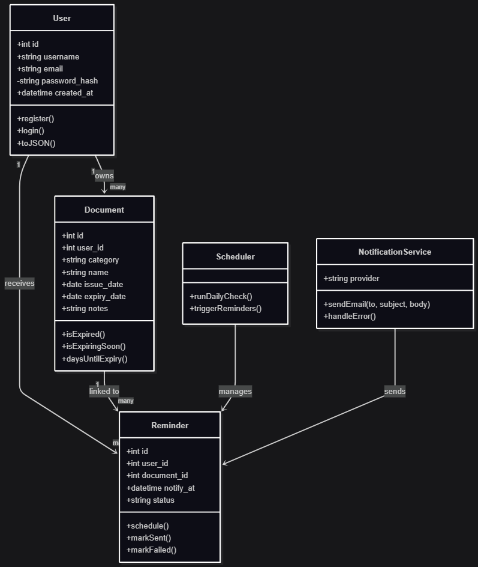

The presented UML diagram models the **business entities** and **application services** required for the functioning of the **Expiry Tracker** API.  
It follows **Single Responsibility Principle (SRP)**, promotes **extensibility**, and prepares the solution for **industrialization** (tests, maintenance, evolutions).  

---

### 1) Class `User` — Identity and Access Control
- **Role**: represent a user account and carry the minimal authentication/authorization information.  
- **Attributes**: `id`, `username`, `email`, `password_hash`, `created_at`.  
- **Methods**: `register()`, `login()`, `toJSON()`.  
- **Justification**: isolating user logic simplifies authentication, compliance, and GDPR management.  

---

### 2) Class `Document` — Tracked Resource with Temporal Logic
- **Role**: represent a tracked document with its **key dates**.  
- **Attributes**: `id`, `user_id`, `category`, `name`, `issue_date`, `expiry_date`, `notes`.  
- **Methods**: `isExpired()`, `isExpiringSoon()`, `daysUntilExpiry()`.  
- **Justification**: centralizing temporal logic avoids duplication and makes business rules testable.  

---

### 3) Class `Reminder` — Scheduling and Traceability of Notifications
- **Role**: model a reminder to be sent at a given date/time for a specific user and document.  
- **Attributes**: `id`, `user_id`, `document_id`, `notify_at`, `status`.  
- **Methods**: `schedule()`, `markSent()`, `markFailed()`.  
- **Justification**: separating **scheduling** from **execution** maximizes resilience and readability.  

---

### 4) Class `NotificationService` — Email Provider Integration
- **Role**: adapt the application to an email provider (SendGrid, Mailgun).  
- **Attributes**: `provider`.  
- **Methods**: `sendEmail()`, `handleError()`.  
- **Justification**: Adapter pattern → provider can be replaced without impacting business logic.  

---

### 5) Class `Scheduler` — Planned Orchestration
- **Role**: execute a recurring task (e.g., daily) to scan expirations and trigger reminders.  
- **Methods**: `runDailyCheck()`, `triggerReminders()`.  
- **Justification**: decoupling scheduling (batch) from real-time (API) ensures punctuality and scalability.  

---

### Main Class Relationships
- `User` owns multiple `Document`.  
- Each `Document` may generate multiple `Reminder`.  
- Each `User` receives multiple `Reminder`.  
- `Scheduler` orchestrates the execution of reminders.  
- `NotificationService` ensures sending notifications related to reminders.  

---

### Business Assumptions and Rules
1. “Expiring soon” window is configurable (30 days).  
2. Multiple reminders per document are possible (D-30, D-15, D-1).  
3. Idempotency on email sending (avoid duplicates).  
4. Strict data validation (dates, emails, uniqueness).  
5. Security: no clear-text passwords, short-lived JWT, GDPR best practices respected.  

---

### Technical Considerations
- **ORM Mapping**: each class corresponds to an SQL table via an ORM.  
- **Light Controllers**: only handle HTTP orchestration; logic remains inside classes.  
- **Transactions**: ensure consistency when creating/updating documents and reminders.  
- **Indexing**: on `expiry_date`, `notify_at`, `user_id` for performance.  
- **Observability**: logs of sends, success/failure rates, correlation by `reminder.id`.  

---

### Planned Extensibility
- Add new channels (SMS, push notifications).  
- Handle more complex recurring reminders.  
- Team-sharing features.  
- Configurable category repository.  

---

### Quality and Testing
- **Unit tests**: methods of `Document`, `Reminder`, `NotificationService`.  
- **Integration tests**: REST endpoints (CRUD for documents, reminders, auth).  
- **End-to-End (optional)**: full user → reminder received scenario.  


## High-Level Sequence Diagrams  

The following sequence diagrams illustrate the most critical interactions between the components of the **Expiry Tracker** system.  
These diagrams help visualize how the **Frontend**, **Backend**, **Database**, and **External Services** cooperate to provide a smooth user experience.  

---

### 1. User Login  

This sequence shows how a user logs into the system by submitting credentials, which are validated by the backend.  
If successful, the backend generates a **JWT token** that is returned to the frontend for authenticated requests.  

**Key steps:**  
1. User submits username and password in the login form.  
2. The Frontend sends credentials to the Backend API.  
3. Backend validates the credentials against the `users` table in PostgreSQL.  
4. If valid, the Backend generates a JWT and returns it to the Frontend.  
5. User is redirected to their Dashboard.  

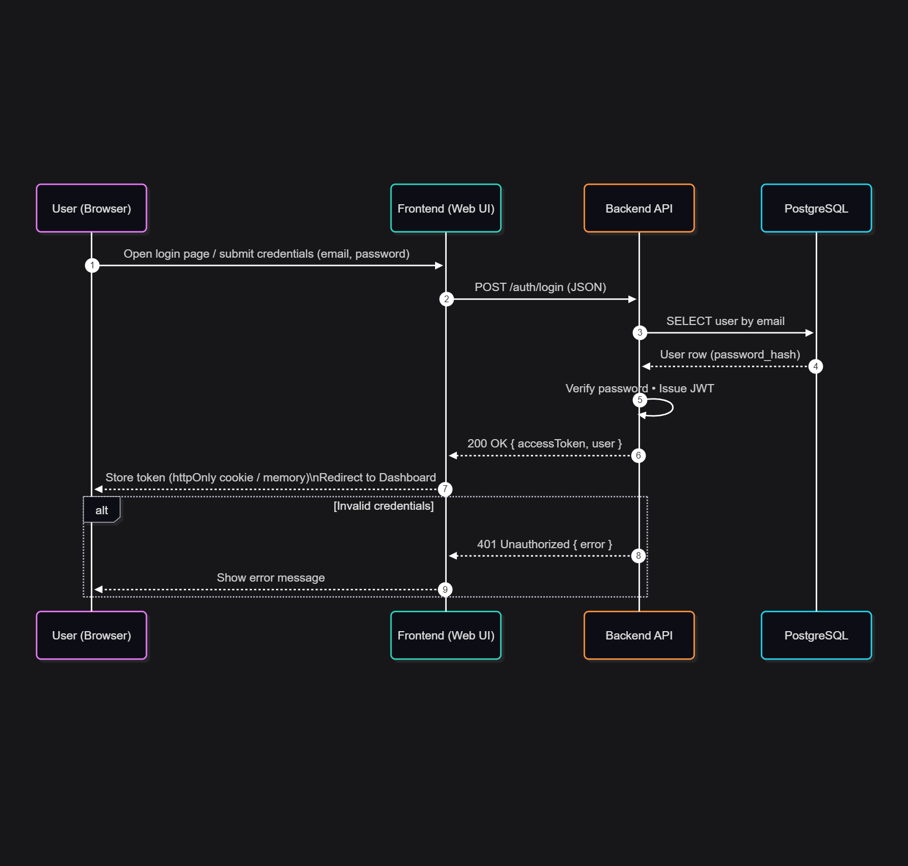  

---

### 2. User Adds a Document  

This sequence describes how a user saves a new document with its issue and expiry dates.  
The system stores this information in the database and confirms the addition.  

**Key steps:**  
1. User selects a category (exemple : Administration) and fills in document details.  
2. Frontend sends a `POST` request with the document data to the Backend.  
3. Backend validates the input and saves the document into the `documents` table.  
4. Backend responds with confirmation (success or error).  
5. Frontend updates the Dashboard to show the new document with its status.  

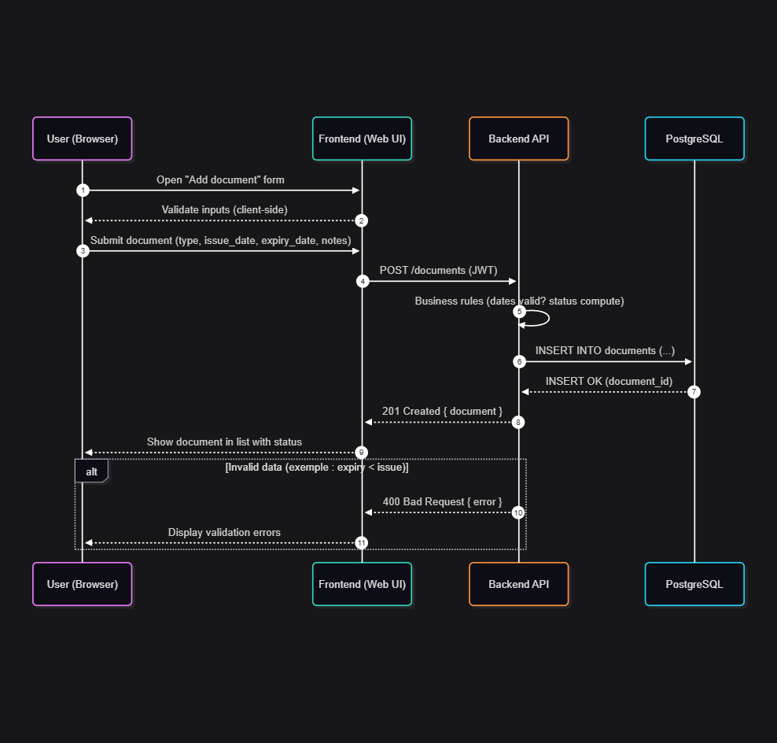  

---

### 3. Email Reminder Notifications  
 
This sequence explains how the system automatically checks for upcoming expirations and sends reminder emails.  
It highlights the interaction between the Scheduler, Backend, Database, and the Email Service Provider.  

**Key steps:**  
1. The **Scheduler (cron job)** triggers a daily check.  
2. Backend queries the `documents` table for items expiring soon.  
3. For each expiring document, a new entry is added to the `reminders` table.  
4. Backend calls the external Email Service (SendGrid/Mailgun) with the reminder details.  
5. The Email Service delivers the reminder to the user’s inbox.  

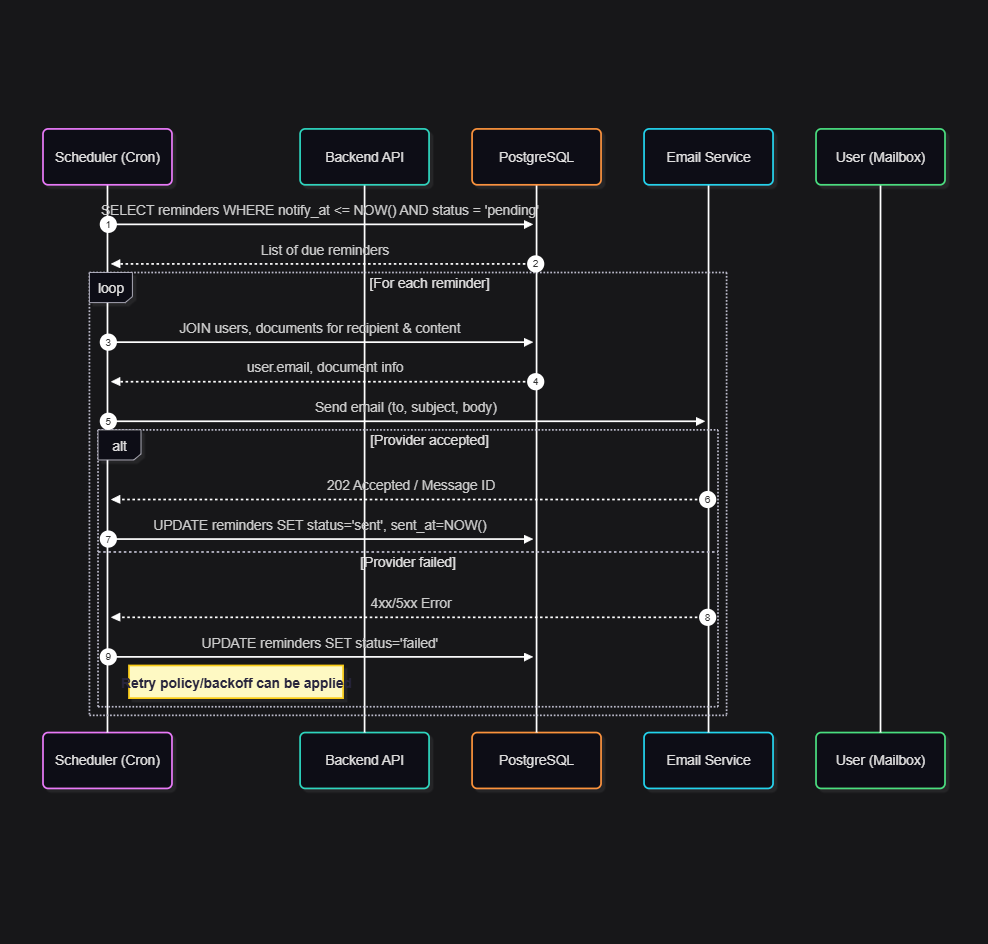  


# Stage 3 – Technical Documentation  
## Task 4: External and Internal APIs  

---

## 1. External APIs  

Expiry Tracker uses an external email provider to send reminder notifications and account emails.  

### Example: SendGrid (or Mailgun)  
- **Purpose:** Outbound email delivery for reminders and account emails.  
- **Reason chosen:** Reliability, scalability, analytics.  
- **Integration:** Backend calls the provider’s REST API with JSON payloads, using API key stored in environment variables.  

---

## 2. Internal API (Expiry Tracker REST API)  

**Base URL:** `/api/v1`  
**Authentication:** Bearer JWT in the `Authorization` header.  
**Content-Type:** `application/json`  

---

### 2.1 Authentication  

#### Register a new user  
- **URL:** `/api/v1/auth/register`  
- **Method:** `POST`  
- **Input (JSON):**  
```json
{
  "username": "john_doe",
  "email": "john@example.com",
  "password": "securePassword123"
}
```  
- **Output (JSON):**  
```json
{
  "user": {
    "id": 1,
    "username": "john_doe",
    "email": "john@example.com"
  },
  "accessToken": "eyJhbGciOiJIUzI1NiIsInR..."
}
```  

---

#### Login  
- **URL:** `/api/v1/auth/login`  
- **Method:** `POST`  
- **Input (JSON):**  
```json
{
  "email": "john@example.com",
  "password": "securePassword123"
}
```  
- **Output (JSON):**  
```json
{
  "user": {
    "id": 1,
    "username": "john_doe",
    "email": "john@example.com"
  },
  "accessToken": "eyJhbGciOiJIUzI1NiIsInR..."
}
```  

---

### 2.2 Documents  

#### List all documents  
- **URL:** `/api/v1/documents`  
- **Method:** `GET`  
- **Output (JSON):**  
```json
{
  "items": [
    {
      "id": 42,
      "name": "Passport",
      "category": "Administration",
      "issue_date": "2015-12-10",
      "expiry_date": "2025-12-10",
      "status": "expiring",
      "notes": "Renew 1–2 months early"
    }
  ]
}
```  

---

#### Add a new document  
- **URL:** `/api/v1/documents`  
- **Method:** `POST`  
- **Input (JSON):**  
```json
{
  "name": "Passport",
  "category": "Administration",
  "issue_date": "2015-12-10",
  "expiry_date": "2025-12-10"
}
```  
- **Output (JSON):**  
```json
{
  "id": 102,
  "name": "Passport",
  "category": "Administration",
  "issue_date": "2015-12-10",
  "expiry_date": "2025-12-10",
  "status": "expiring"
}
```  

---

### 2.3 Reminders  

#### Create a reminder  
- **URL:** `/api/v1/reminders`  
- **Method:** `POST`  
- **Input (JSON):**  
```json
{
  "document_id": 102,
  "notify_at": "2025-11-10T09:00:00Z"
}
```  
- **Output (JSON):**  
```json
{
  "id": 501,
  "document_id": 102,
  "notify_at": "2025-11-10T09:00:00Z",
  "status": "pending"
}
```  

---

## 3. Error Codes  

- `400` – Bad Request  
- `401` – Unauthorized  
- `403` – Forbidden  
- `404` – Not Found  
- `409` – Conflict  
- `500` – Internal Server Error  

---

## 4. Security Notes  

- Passwords are hashed with bcrypt/argon2.  
- JWT tokens are short-lived.  
- Input validation and sanitation on all endpoints.  
- Ownership checks for all user resources.  


This document defines the **Source Control Management (SCM)** processes and the **Quality Assurance (QA)** strategy for the Expiry Tracker MVP.

---

## 1) SCM Strategy (branching, commits, reviews)

### 1.1 Version Control
- Tool: **Github**
- Default branch: **main**
- Protected branches: **main**, **develop**

### 1.2 Branching Model
- **main** → production-ready code.
- **develop** → integration branch (pre-release).
- **feature/**`short-desc` → for each task/user story.  
  Examples: `feature/auth-register`, `feature/documents-crud`
- **hotfix/**`issue-id-short-desc` → urgent fixes from `main`.
- **release/**`vX.Y.Z` → stabilization before a production release.

**Flow (summary):**
1. `feature/*` branches off **develop**.
2. Open PR → merge into **develop** after review & CI green.
3. Create `release/vX.Y.Z` from **develop`** → fix only bugs → merge to **main** and back-merge to **develop**.
4. Tag **main** with **semver** tag `vX.Y.Z`.
5. Hotfix: branch from **main**, PR → **main**, then back-merge to **develop**.

### 1.3 Commit Conventions
- **Conventional Commits**:
  - `feat: add document creation endpoint`
  - `fix: correct expiry date validation`
  - `docs: add API task 4`
  - `test: add unit tests for reminders`
  - `refactor: split controller into service`
  - `chore: bump dependencies`
- One logical change per commit; commit often (at least daily during active work).

### 1.4 Pull Requests & Code Reviews
- **PR template** includes: scope, screenshots (if UI), test plan, checklist.
- **Review policy**:
  - Min. **1 approver** (2 for risky changes).
  - Required checks: CI build + tests + lint + type-check.
  - Block merge on: failing checks, < coverage threshold, unresolved comments.
- **Definition of Done** (DoD) for a PR:
  - Code compiles, tests pass locally.
  - Unit tests added/updated.
  - API/README updated if needed.
  - No critical ESLint/Prettier issues.

### 1.5 Tagging & Releases
- **Semantic Versioning**: `MAJOR.MINOR.PATCH`
  - Breaking: MAJOR↑
  - Feature: MINOR↑
  - Bug fix: PATCH↑
- Tag on **main**: `vX.Y.Z`.  
- Create **GitHub Release** notes from merged PR titles.

### 1.6 Branch Protection Rules
- Require PR.
- Require status checks to pass (build, tests, lint).
- Require up-to-date with base branch.
- Dismiss stale reviews on new commits.
- Restrict who can push to **main**.

---

## 2) QA Strategy (testing tools, types of tests, pipeline)

### 2.1 Testing Pyramid & Scope
- **Unit tests** (fast, isolated): services, utils, domain logic (expiry calculations).
- **Integration tests**: API endpoints + DB (via test database).
- **E2E / UI tests** : critical user flows through the UI (optional for MVP but recommended).
- **Contract tests** (optional): provider mocks for Email API.

### 2.2 Tools
- **Backend unit/integration**: **Jest** + **Supertest** (Node/Express).  
- **API collections/manual checks**: **Postman** (automation with **Newman** in CI).  
- **E2E Web** (optional for MVP): **Playwright** or **Cypress**.  
- **Static analysis**: **ESLint**, **Prettier**.  
- **Types** (if TS): **TypeScript** `tsc --noEmit`.  
- **Coverage**: Jest coverage reports (target ≥ **80% lines**, **80% branches** for MVP).  
- **Security**: `npm audit` (or `yarn npm audit`), **OWASP ZAP**.  
- **Dependency updates**: Dependabot/Renovate (weekly).

### 2.3 Test Data & Environments
- **Databases**:
  - `expirytracker_dev` (developer local)
  - `expirytracker_test` (CI; ephemeral)
  - `expirytracker_staging`
  - `expirytracker_prod`
- Migrations via **Prisma** / **TypeORM** / **Sequelize** (pick one).  
- **Seed scripts** for local and E2E minimal data.  
- **Secrets** via environment variables (.env for local only; vaulted in CI/CD and cloud).

### 2.4 What to Test

**Unit (examples)**
- `Document.isExpired()`, `isExpiringSoon()`, `daysUntilExpiry()`
- Validation logic (issue_date <= expiry_date).
- Reminder scheduling logic (compute notify_at).

**Integration (examples)**
- `POST /auth/register` and `POST /auth/login` (happy path + invalid).
- `POST /documents`, `GET /documents`, `PUT/PATCH /documents/:id`, `DELETE`.
- Ownership checks: user cannot access others’ documents.
- Reminder creation status and list endpoints.

**E2E (smoke)**
- Register → Login → Add document → See status.
- (Optional) Simulate scheduler → verify reminder recorded/sent (with email provider mocked).

### 2.5 CI/CD Pipeline Overview

**CI (on PRs to develop/main)**
1. Install deps (cache).
2. Lint (`eslint .`) and format check (`prettier --check`).
3. Type-check (`tsc --noEmit`) if TS.
4. Unit + integration tests (`jest --coverage`).
5. API tests (optional) with Newman.
6. Build artifact (Docker image) on `main` and `release/*`.

**CD**
- **Staging**: auto-deploy on merge to **develop** or tag `-rc`.  
  - Run DB migrations.
  - Smoke tests after deploy.
- **Production**: manual approval on tag `vX.Y.Z`.  
  - Run DB migrations.
  - Health check endpoint `/health`.
  - Rollback plan (previous image + migrations down if safe).

**Example GitHub Actions (outline)**:
```yaml
name: ci
on:
  pull_request:
    branches: [develop, main]
jobs:
  build-and-test:
    runs-on: ubuntu-latest
    steps:
      - uses: actions/checkout@v4
      - uses: actions/setup-node@v4
        with: { node-version: '20' }
      - run: npm ci
      - run: npm run lint
      - run: npm run typecheck
      - run: npm run test -- --coverage
```

### 2.6 Quality Gates (hard requirements)
- CI green (build + tests + lint + type-check).  
- Coverage ≥ 80% (lines & branches) for changed packages/dirs.  
- No critical/high vulnerabilities (audit) without an exception ticket.  
- API changes documented in `OPENAPI.md` (or Swagger YAML) and changelog updated for release PRs.

### 2.7 Manual QA (pre-release)
- Checklist on `release/*` branch:
  - Auth flows (register/login/logout).
  - CRUD documents (happy/invalid/ownership).
  - Reminder list rendering and statuses.
  - Email service mocked: request payload correctness.
  - Accessibility quick pass (tab order, form labels).
  - Mobile viewport smoke (responsive layout).

---

## 3) Environments & Deployment

- **Local**: Docker Compose (app + Postgres + mail mock like MailHog).  
- **Staging**: same as prod; feature flagged; sample accounts; real email disabled or sandboxed.  
- **Production**: scalable container runtime (e.g., Docker on ECS/Kubernetes); managed Postgres; secrets via cloud KMS/Secrets Manager.

**Observability**
- Logs: structured JSON (request id, user id, endpoint, latency).  
- Metrics: request rate, error rate, latency (p95), email send success rate.  
- Alerts: uptime, elevated 5xx, email provider failures.

---

## 4) Responsibilities & Rituals

- **Daily commits**, small PRs (< 400 LOC preferred).  
- **Standups**: blockers, testing status, QA risks.  
- **Weekly release cadence** (or on-demand for MVP).  
- **Retrospective**: CI duration, flaky tests, escaped defects.

---

## 5) Checklists

### PR Checklist
- [ ] Small, focused changes; clear title using Conventional Commits  
- [ ] Lint/format OK  
- [ ] Tests added/updated  
- [ ] Docs/API updated if needed  
- [ ] No secrets committed  
- [ ] Reviewed and approved

### Release Checklist
- [ ] `release/vX.Y.Z` branch created  
- [ ] Changelog updated  
- [ ] Staging deployed + smoke passed  
- [ ] Tag `vX.Y.Z` created on `main`  
- [ ] Production deploy approved  
- [ ] Post-deploy health check OK  
- [ ] Rollback plan verified

---

## 6) Rationale

- **Git flow (lightweight)** provides clarity between feature work, integration, and production stability.  
- **Conventional Commits** enables automated changelogs and consistent history.  
- **Testing pyramid** reduces cost: most checks are fast unit/integration tests; a few E2E cover critical paths.  
- **CI quality gates** prevent regressions; **staging** mirrors prod for realistic validation.  
- **Observability** shortens time-to-detect and time-to-recover.

