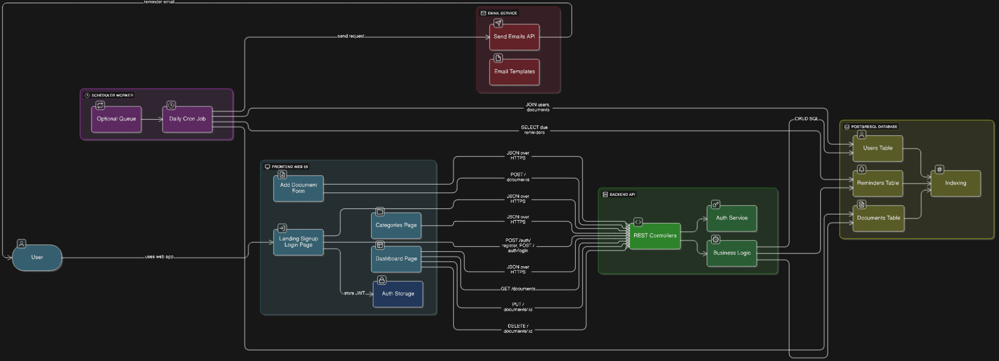

# Stage 3 – Technical Documentation

## 1. Design System Architecture

### System Architecture Explanation

The architecture of the **Expiry Tracker** application is based on a **classic client-server model**, designed to be easy to maintain and scalable.  
It is composed of several main layers that work together to provide a smooth user experience.

---

### 1. Frontend – Web UI
The **Frontend Web UI** is the interface visible to the user, developed using **HTML, CSS, and JavaScript**.  
It contains the essential screens of the application:  

- Landing page  
- Registration  
- Login  
- Dashboard  
- Category selection  
- Document addition forms  

Its role is to allow the user to:  
- enter their information ( issue and expiration dates of a document),  
- view their reminders,  
- receive clear visual feedback on the status of their documents (valid, expiring soon, expired).  

The frontend does not act alone: it **communicates with the backend** through **HTTP requests (REST API)** using the **JSON** format.

---

### 2. Backend – API
The **Backend API** provides the **business logic** of the application.  
It is responsible for several key tasks:  

- Managing authentication and user security with **JWT tokens**.  
- Exposing **REST endpoints** to create, read, update, and delete documents. (CRUD)
- Applying business rules (calculating the status of documents based on their expiration dates).  

The backend is developed with a framework such as **Node.js/Express** and **Python/Flask**, ensuring fast and reliable communication between the user interface and the database.

---

### 3. Database – PostgreSQL
The **PostgreSQL database** securely stores all information in a **structured manner**.  
It includes three main tables:  

- **users**: user account information  
  - id  
  - name  
  - email  
  - hashed password  

- **documents**: tracked documents  
  - id  
  - type  
  - issue date  
  - expiration date  
  - associated user  

- **reminders**: automated reminders  
  - id  
  - document_id  
  - reminder date  
  - reminder status (sent or not)  

The choice of **PostgreSQL** is justified by:  
- its reliability,  
- its open-source and free nature,  
- its advanced relational features, perfectly suited for this type of application.

---

### 4. Complementary Services

Two additional services strengthen the system architecture and automate document tracking:  

- **Scheduler (Cron job)**: runs daily to check for documents approaching expiration and trigger reminders.  
- **External email service (SendGrid, Mailgun, etc.)**: securely and reliably sends notifications to users, without managing the email-sending infrastructure directly.

---

### 5. Separation of Concerns

This layered architecture ensures a clear separation of responsibilities:  

- **Frontend** → user experience.  
- **Backend** → business logic and security.  
- **Database** → data storage and consistency.  
- **External services** → automation and notifications.  

Thanks to this structure, the system is:  
- **robust**: each layer is independent,  
- **easy to maintain**: changes in one layer do not impact the whole system,  
- **scalable**: new features (SMS notifications, mobile app) can be added without rebuilding everything.

---

### Architecture Diagram

The diagram below illustrates how the components and services interact:  

VERSION FRANCAISE :

Explication de l’architecture du système

L’architecture de l’application Expiry Tracker repose sur un modèle client-serveur classique, conçu pour être simple à maintenir et évolutif. Elle est composée de plusieurs couches principales qui coopèrent pour offrir une expérience fluide à l’utilisateur.

La première couche est le Frontend Web UI. C’est l’interface visible par l’utilisateur, développée en HTML, CSS et JavaScript. Elle contient les écrans essentiels de l’application : page d’accueil, inscription, connexion, tableau de bord (dashboard), catégories et formulaires d’ajout de documents. Le rôle du frontend est de permettre à l’utilisateur de saisir ses informations (par exemple les dates de délivrance et d’expiration d’un document), de consulter ses rappels et de recevoir des retours visuels clairs sur l’état de ses documents (valide, bientôt expiré ou expiré). Le frontend n’agit pas seul : il envoie et reçoit des données depuis le backend via des requêtes HTTP au format JSON.

La seconde couche est le Backend API, qui constitue la logique métier de l’application. Il est responsable de plusieurs missions clés :

gérer l’authentification et la sécurité des utilisateurs grâce aux jetons JWT ;

fournir des points de terminaison (endpoints REST) pour créer, lire, mettre à jour et supprimer les documents ;

appliquer la logique métier, comme le calcul du statut des documents en fonction de leurs dates d’expiration.
Ce backend est développé avec un framework adapté (Node.js/Express ou Python/Flask), afin d’assurer une communication rapide et fiable entre l’interface utilisateur et la base de données.

La troisième couche est la base de données PostgreSQL, qui stocke toutes les informations de manière structurée et sécurisée. Trois tables principales y sont définies :

users : contient les informations des comptes utilisateurs (id, nom, email, mot de passe chiffré) ;

documents : regroupe les différents documents suivis (type, dates de délivrance et d’expiration, utilisateur associé) ;

reminders : permet de planifier les rappels pour notifier l’utilisateur à l’avance.
L’utilisation de PostgreSQL se justifie par sa fiabilité, sa gratuité et ses fonctionnalités avancées de gestion des relations entre tables, parfaitement adaptées à ce type d’application.

Enfin, deux services complémentaires renforcent l’architecture :

un scheduler (ou tâche planifiée, via un cron job) qui s’exécute automatiquement chaque jour afin de vérifier les documents arrivant à échéance et de déclencher les rappels nécessaires ;

un service d’e-mails externe (comme SendGrid ou Mailgun), utilisé pour envoyer de manière sécurisée et fiable les notifications aux utilisateurs, sans avoir à gérer directement l’infrastructure d’envoi d’e-mails.

Cette organisation en couches distinctes permet une séparation claire des responsabilités : le frontend se concentre sur l’expérience utilisateur, le backend sur la logique et la sécurité, la base de données sur le stockage des données, et les services externes sur l’automatisation et les notifications. Ce découpage rend le système plus robuste, plus facile à maintenir et plus évolutif. En cas d’évolution future, chaque couche pourra être améliorée ou remplacée sans affecter l’ensemble du système.