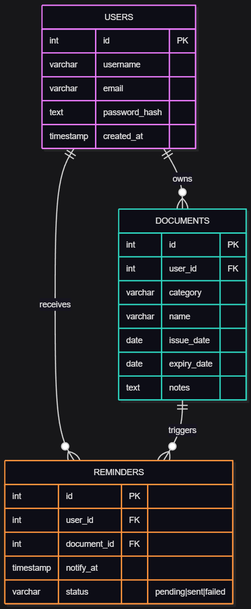

# Stage 3 – Technical Documentation

## 2. Define Components, Classes, and Database Design

### 1. Main System Components

The **Expiry Tracker** application is organized into three main layers:  

- **Frontend (Web Interface)**  
  - Developed in HTML, CSS, and JavaScript.  
  - Role: provide the user interface allowing:  
    - user registration and login,  
    - access to the dashboard,  
    - adding and managing documents,  
    - viewing reminders and the status of documents (valid, expiring soon, expired).  

- **Backend (API)**  
  - Developed with Node.js + Express.  
  - Responsibilities:  
    - manage authentication (JWT),  
    - provide REST endpoints for CRUD operations,  
    - implement business logic (date and expiration status calculations),  
    - communicate with the database,  
    - trigger reminders via a scheduler.  

- **Database (PostgreSQL)**  
  - Stores users, documents, and reminders.  
  - A robust relational system that ensures data integrity and efficient date handling.  

- **External Services**  
  - Email provider (SendGrid, Mailgun) to reliably send reminders.  

---

### 2. Main Backend Classes  

#### Class `User`  
**Attributes:**  
- `id` : unique identifier  
- `username` : user name  
- `email` : unique email address  
- `password_hash` : hashed password  
- `created_at` : account creation date  

**Methods:**  
- `register()` → create a new user  
- `login()` → verify credentials and generate a JWT  
- `toJSON()` → return a safe version of the user object  

---

#### Class `Document`  
**Attributes:**  
- `id` : unique identifier  
- `user_id` : reference to the owner user  
- `category` : document category (administration, banking, health, etc.)  
- `name` : document type (ID card, passport, bank card…)  
- `issue_date` : date of issuance  
- `expiry_date` : expiration date  
- `notes` : optional field for additional remarks  

**Methods:**  
- `isExpired()` → returns true if the document has expired  
- `isExpiringSoon()` → returns true if the document will expire soon  
- `daysUntilExpiry()` → calculates the remaining days  

---

#### Class `Reminder`  
**Attributes:**  
- `id` : unique identifier  
- `user_id` : associated user  
- `document_id` : related document  
- `notify_at` : scheduled reminder date  
- `status` : pending / sent / failed  

**Methods:**  
- `schedule()` → plan a reminder  
- `markSent()` → update status to “sent”  
- `markFailed()` → update status to “failed”  

---

#### Class `NotificationService`  
**Attributes:**  
- `provider` : service used (SendGrid, Mailgun)  

**Methods:**  
- `sendEmail(to, subject, body)` → send an email  
- `handleError()` → manage errors and retry if necessary  

---

#### Class `Scheduler`  
**Methods:**  
- `runDailyCheck()` → perform the daily check of documents  
- `triggerReminders()` → trigger the sending of reminders  

---

### 3. Database Design (PostgreSQL)  

#### Table `users`  
| Field         | Type          | Constraints                      |  
|---------------|---------------|----------------------------------|  
| id            | SERIAL        | PRIMARY KEY                      |  
| username      | VARCHAR(50)   | NOT NULL, UNIQUE                 |  
| email         | VARCHAR(100)  | NOT NULL, UNIQUE                 |  
| password_hash | TEXT          | NOT NULL                         |  
| created_at    | TIMESTAMP     | DEFAULT CURRENT_TIMESTAMP        |  

---

#### Table `documents`  
| Field         | Type          | Constraints                      |  
|---------------|---------------|----------------------------------|  
| id            | SERIAL        | PRIMARY KEY                      |  
| user_id       | INT           | FOREIGN KEY → users(id)          |  
| category      | VARCHAR(50)   | NOT NULL                         |  
| name          | VARCHAR(100)  | NOT NULL                         |  
| issue_date    | DATE          | NOT NULL                         |  
| expiry_date   | DATE          | NOT NULL                         |  
| notes         | TEXT          | NULL                             |  

---

#### Table `reminders`  
| Field         | Type          | Constraints                                   |  
|---------------|---------------|-----------------------------------------------|  
| id            | SERIAL        | PRIMARY KEY                                   |  
| user_id       | INT           | FOREIGN KEY → users(id)                       |  
| document_id   | INT           | FOREIGN KEY → documents(id)                   |  
| notify_at     | TIMESTAMP     | NOT NULL                                      |  
| status        | VARCHAR(20)   | CHECK (status IN ('pending','sent','failed')) |  

---

### 4. Main Interactions  

- **Frontend → Backend**: the user enters information, and the frontend sends HTTP requests (JSON).  
- **Backend → Database**: the backend performs CRUD operations on the tables (users, documents, reminders).  
- **Backend → Email Service**: when an expiration is approaching, the backend triggers a reminder via the external provider.  
- **Scheduler → DB + Emails**: a daily cron job checks expirations and calls the email service to notify the user.  

---

VERSION FRANCAISE :

### 1. Composants principaux du système  

L’application **Expiry Tracker** est organisée en trois couches principales :  

- **Frontend (Interface Web)**  
  - Développée en HTML, CSS et JavaScript.  
  - Rôle : fournir l’interface utilisateur permettant :  
    - l’inscription et la connexion,  
    - l’accès au tableau de bord,  
    - l’ajout et la gestion des documents,  
    - la consultation des rappels et de l’état des documents (valide, bientôt expiré, expiré).  

- **Backend (API)**  
  - Développé avec Node.js + Express.  
  - Responsabilités :  
    - gestion de l’authentification (JWT),  
    - mise à disposition des endpoints REST pour les opérations CRUD,  
    - logique métier (calcul des dates et des statuts d’expiration),  
    - communication avec la base de données,  
    - déclenchement des rappels via un scheduler.  

- **Base de données (PostgreSQL)**  
  - Stocke les utilisateurs, documents et rappels.  
  - Système relationnel robuste qui assure l’intégrité des données et permet de gérer efficacement les dates.  

- **Services externes**  
  - Fournisseur d’e-mails (SendGrid, Mailgun) pour envoyer les rappels de manière fiable.  

### 2. Classes principales du Backend  

#### Classe `User`  
**Attributs :**  
- `id` : identifiant unique  
- `username` : nom d’utilisateur  
- `email` : adresse e-mail unique  
- `password_hash` : mot de passe chiffré  
- `created_at` : date de création du compte  

**Méthodes :**  
- `register()` → créer un nouvel utilisateur  
- `login()` → vérifier les identifiants et générer un JWT  
- `toJSON()` → retourner une version sécurisée de l’objet utilisateur  

---

#### Classe `Document`  
**Attributs :**  
- `id` : identifiant unique  
- `user_id` : référence vers l’utilisateur propriétaire  
- `category` : catégorie du document (administration, bancaire, santé, etc.)  
- `name` : nom/type du document (carte d’identité, passeport, carte bancaire…)  
- `issue_date` : date de délivrance  
- `expiry_date` : date d’expiration  
- `notes` : champ optionnel pour des remarques  

**Méthodes :**  
- `isExpired()` → retourne true si le document est expiré  
- `isExpiringSoon()` → retourne true si le document expire bientôt  
- `daysUntilExpiry()` → calcule le nombre de jours restants  

---

#### Classe `Reminder`  
**Attributs :**  
- `id` : identifiant unique  
- `user_id` : utilisateur associé  
- `document_id` : document concerné  
- `notify_at` : date prévue du rappel  
- `status` : pending / sent / failed  

**Méthodes :**  
- `schedule()` → planifier un rappel  
- `markSent()` → mettre à jour le statut en “sent”  
- `markFailed()` → mettre à jour le statut en “failed”  

---

#### Classe `NotificationService`  
**Attributs :**  
- `provider` : service utilisé (SendGrid, Mailgun)  

**Méthodes :**  
- `sendEmail(to, subject, body)` → envoi d’un e-mail  
- `handleError()` → gérer les erreurs et relancer si nécessaire  

---

#### Classe `Scheduler`  
**Méthodes :**  
- `runDailyCheck()` → exécuter la vérification quotidienne des documents  
- `triggerReminders()` → déclencher l’envoi des rappels  

---

### 3. Design de la base de données (PostgreSQL)  

#### Table `users`  
| Champ         | Type          | Contraintes                      |  
|---------------|---------------|----------------------------------|  
| id            | SERIAL        | PRIMARY KEY                      |  
| username      | VARCHAR(50)   | NOT NULL, UNIQUE                 |  
| email         | VARCHAR(100)  | NOT NULL, UNIQUE                 |  
| password_hash | TEXT          | NOT NULL                         |  
| created_at    | TIMESTAMP     | DEFAULT CURRENT_TIMESTAMP        |  

---

#### Table `documents`  
| Champ         | Type          | Contraintes                      |  
|---------------|---------------|----------------------------------|  
| id            | SERIAL        | PRIMARY KEY                      |  
| user_id       | INT           | FOREIGN KEY → users(id)          |  
| category      | VARCHAR(50)   | NOT NULL                         |  
| name          | VARCHAR(100)  | NOT NULL                         |  
| issue_date    | DATE          | NOT NULL                         |  
| expiry_date   | DATE          | NOT NULL                         |  
| notes         | TEXT          | NULL                             |  

---

#### Table `reminders`  
| Champ         | Type          | Contraintes                                   |  
|---------------|---------------|-----------------------------------------------|  
| id            | SERIAL        | PRIMARY KEY                                   |  
| user_id       | INT           | FOREIGN KEY → users(id)          				|  
| document_id   | INT           | FOREIGN KEY → documents(id)      				|  
| notify_at     | TIMESTAMP     | NOT NULL                         				|  
| status        | VARCHAR(20)   | CHECK (status IN ('pending','sent','failed')) |  

---

### 4. Interactions principales  

- **Frontend → Backend** : l’utilisateur saisit ses informations, le frontend envoie des requêtes HTTP (JSON).  
- **Backend → Base de données** : le backend effectue les opérations CRUD sur les tables (users, documents, reminders).
- **Backend → Service d’e-mails** : lorsqu’une expiration est proche, le backend déclenche un rappel via le fournisseur externe.
- **Scheduler → DB + E-mails** : un cron job quotidien vérifie les expirations et appelle le service d’e-mails pour notifier l’utilisateur.
