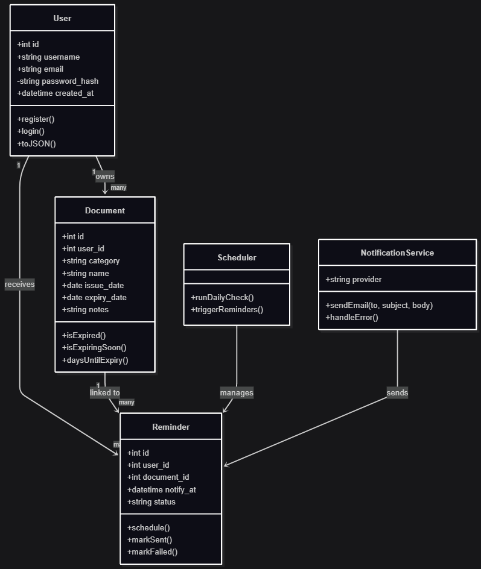

## UML Diagram (Backend)

The presented UML diagram models the **business entities** and **application services** required for the functioning of the **Expiry Tracker** API.  
It follows **Single Responsibility Principle (SRP)**, promotes **extensibility**, and prepares the solution for **industrialization** (tests, maintenance, evolutions).  

---

### 1) Class `User` — Identity and Access Control
- **Role**: represent a user account and carry the minimal authentication/authorization information.  
- **Attributes**: `id`, `username`, `email`, `password_hash`, `created_at`.  
- **Methods**: `register()`, `login()`, `toJSON()`.  
- **Justification**: isolating user logic simplifies authentication, compliance, and GDPR management.  

---

### 2) Class `Document` — Tracked Resource with Temporal Logic
- **Role**: represent a tracked document with its **key dates**.  
- **Attributes**: `id`, `user_id`, `category`, `name`, `issue_date`, `expiry_date`, `notes`.  
- **Methods**: `isExpired()`, `isExpiringSoon()`, `daysUntilExpiry()`.  
- **Justification**: centralizing temporal logic avoids duplication and makes business rules testable.  

---

### 3) Class `Reminder` — Scheduling and Traceability of Notifications
- **Role**: model a reminder to be sent at a given date/time for a specific user and document.  
- **Attributes**: `id`, `user_id`, `document_id`, `notify_at`, `status`.  
- **Methods**: `schedule()`, `markSent()`, `markFailed()`.  
- **Justification**: separating **scheduling** from **execution** maximizes resilience and readability.  

---

### 4) Class `NotificationService` — Email Provider Integration
- **Role**: adapt the application to an email provider (SendGrid, Mailgun).  
- **Attributes**: `provider`.  
- **Methods**: `sendEmail()`, `handleError()`.  
- **Justification**: Adapter pattern → provider can be replaced without impacting business logic.  

---

### 5) Class `Scheduler` — Planned Orchestration
- **Role**: execute a recurring task (e.g., daily) to scan expirations and trigger reminders.  
- **Methods**: `runDailyCheck()`, `triggerReminders()`.  
- **Justification**: decoupling scheduling (batch) from real-time (API) ensures punctuality and scalability.  

---

### Main Class Relationships
- `User` owns multiple `Document`.  
- Each `Document` may generate multiple `Reminder`.  
- Each `User` receives multiple `Reminder`.  
- `Scheduler` orchestrates the execution of reminders.  
- `NotificationService` ensures sending notifications related to reminders.  

---

### Business Assumptions and Rules
1. “Expiring soon” window is configurable (30 days).  
2. Multiple reminders per document are possible (D-30, D-15, D-1).  
3. Idempotency on email sending (avoid duplicates).  
4. Strict data validation (dates, emails, uniqueness).  
5. Security: no clear-text passwords, short-lived JWT, GDPR best practices respected.  

---

### Technical Considerations
- **ORM Mapping**: each class corresponds to an SQL table via an ORM.  
- **Light Controllers**: only handle HTTP orchestration; logic remains inside classes.  
- **Transactions**: ensure consistency when creating/updating documents and reminders.  
- **Indexing**: on `expiry_date`, `notify_at`, `user_id` for performance.  
- **Observability**: logs of sends, success/failure rates, correlation by `reminder.id`.  

---

### Planned Extensibility
- Add new channels (SMS, push notifications).  
- Handle more complex recurring reminders.  
- Team-sharing features.  
- Configurable category repository.  

---

### Quality and Testing
- **Unit tests**: methods of `Document`, `Reminder`, `NotificationService`.  
- **Integration tests**: REST endpoints (CRUD for documents, reminders, auth).  
- **End-to-End (optional)**: full user → reminder received scenario.  

VERSION FR

## diagramme UML (Backend)

Le diagramme UML présenté modélise les **entités métier** et les **services applicatifs** nécessaires au fonctionnement de l’API d’**Expiry Tracker**.  
Il suit des principes de **séparation des responsabilités (SRP)**, favorise l’**extensibilité** et prépare la solution à l’**industrialisation** (tests, maintenance, évolutions).  

### 1) Classe `User` — identité et contrôle d’accès
- **Rôle** : représenter un compte utilisateur et porter les informations minimales d’authentification/autorisation.  
- **Attributs** : `id`, `username`, `email`, `password_hash`, `created_at`.  
- **Méthodes** : `register()`, `login()`, `toJSON()`.  
- **Justification** : isoler la logique utilisateur simplifie l’authentification, la conformité et la gestion RGPD.  

---

### 2) Classe `Document` — ressource suivie avec logique temporelle
- **Rôle** : représenter un document suivi avec ses **dates clés**.  
- **Attributs** : `id`, `user_id`, `category`, `name`, `issue_date`, `expiry_date`, `notes`.  
- **Méthodes** : `isExpired()`, `isExpiringSoon()`, `daysUntilExpiry()`.  
- **Justification** : centraliser la logique temporelle évite la duplication et rend la règle métier testable.  

---

### 3) Classe `Reminder` — planification et traçabilité des rappels
- **Rôle** : modéliser un rappel à envoyer à une date/heure pour un utilisateur et un document donnés.  
- **Attributs** : `id`, `user_id`, `document_id`, `notify_at`, `status`.  
- **Méthodes** : `schedule()`, `markSent()`, `markFailed()`.  
- **Justification** : séparer la **planification** de l’**exécution** maximise la résilience et la lisibilité.  

---

### 4) Classe `NotificationService` — intégration fournisseur d’e-mails
- **Rôle** : adapter l’application à un prestataire d’e-mails (SendGrid, Mailgun).  
- **Attributs** : `provider`.  
- **Méthodes** : `sendEmail()`, `handleError()`.  
- **Justification** : pattern Adapter → changement de fournisseur possible sans impacter la logique métier.  

---

### 5) Classe `Scheduler` — orchestration planifiée
- **Rôle** : exécuter une tâche récurrente (ex. quotidienne) pour scanner les expirations et déclencher les rappels.  
- **Méthodes** : `runDailyCheck()`, `triggerReminders()`.  
- **Justification** : découpler la planification (batch) du temps réel (API) garantit ponctualité et scalabilité.  

---

### Relations principales entre classes
- `User` possède plusieurs `Document`.  
- Chaque `Document` peut générer plusieurs `Reminder`.  
- Chaque `User` reçoit plusieurs `Reminder`.  
- `Scheduler` orchestre l’exécution des rappels.  
- `NotificationService` assure l’envoi des notifications liées aux rappels.  

---

### Hypothèses et règles métier
1. Fenêtre « expiring soon » configurable (ex. 30 jours).  
2. Possibilité de rappels multiples pour un même document (J-30, J-15, J-1).  
3. Idempotence sur l’envoi des e-mails (éviter doublons).  
4. Validation stricte des données (dates, e-mails, unicité).  
5. Sécurité : aucun mot de passe en clair, JWT de courte durée, respect des bonnes pratiques RGPD.  

---

### Considérations techniques
- **Mapping ORM** : chaque classe correspond à une table SQL via un ORM.  
- **Contrôleurs légers** : uniquement orchestration HTTP, logique dans les classes.  
- **Transactions** : cohérence lors de la création/modification des documents et rappels.  
- **Indexation** : sur `expiry_date`, `notify_at`, `user_id` pour performance.  
- **Observabilité** : logs des envois, taux de succès/échec, corrélation par `reminder.id`.  

---

### Extensibilité prévue
- Ajout de nouveaux canaux (SMS, push notifications).  
- Gestion de rappels récurrents plus complexes.  
- Fonctionnalités de partage en équipe.  
- Référentiel de catégories administrable.  

---

### Qualité et tests
- **Unit tests** : méthodes de `Document`, `Reminder`, `NotificationService`.  
- **Intégration** : endpoints REST (CRUD documents, rappels, auth).  
- **E2E (bonus)** : scénario complet utilisateur → rappel reçu.  
