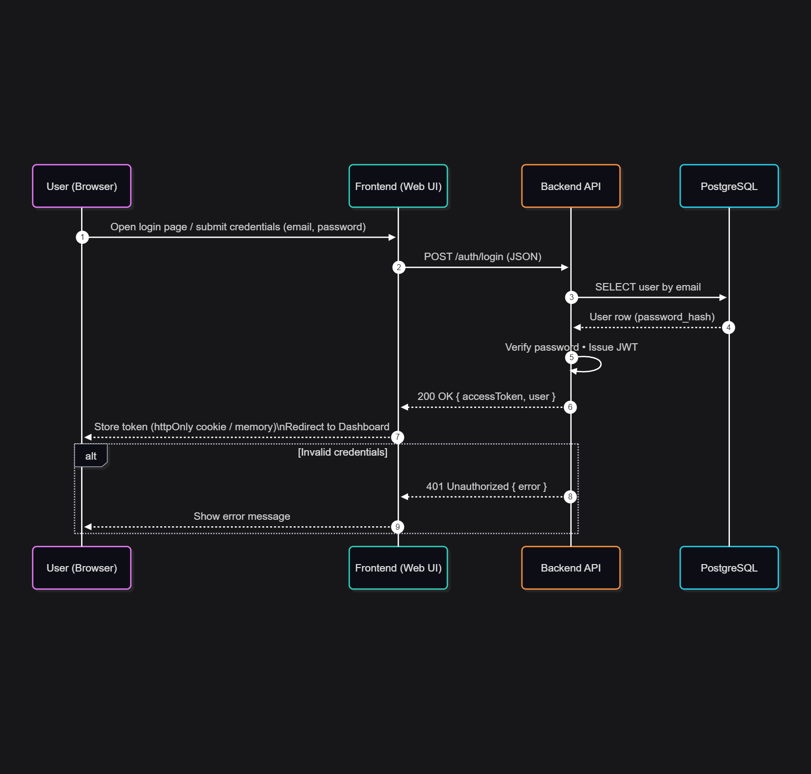
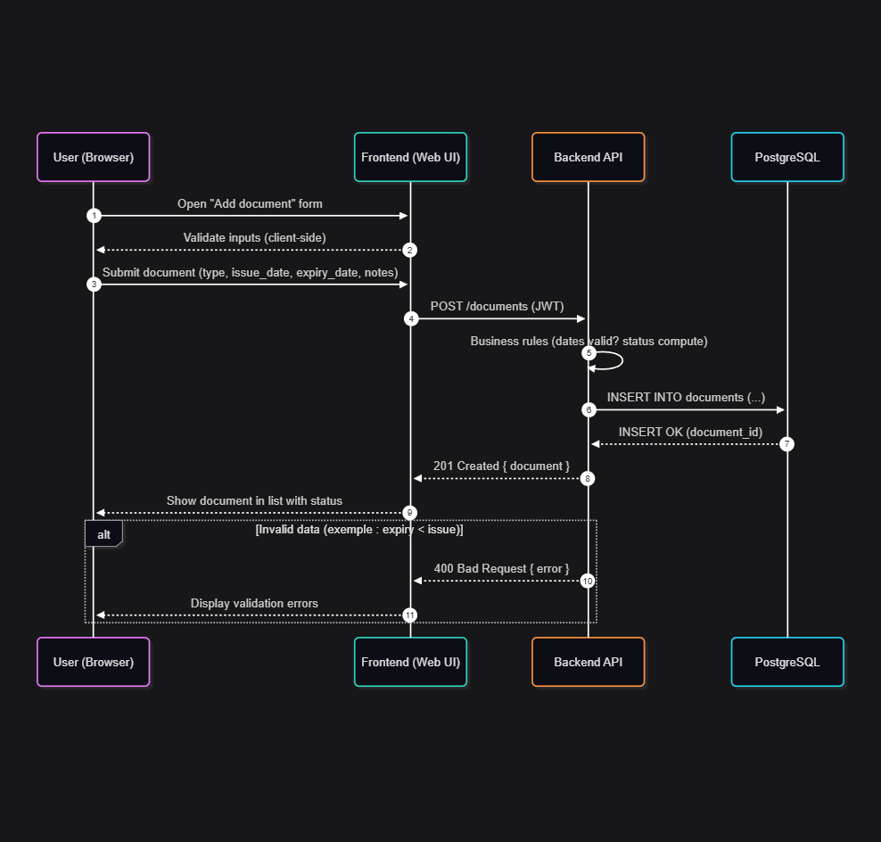
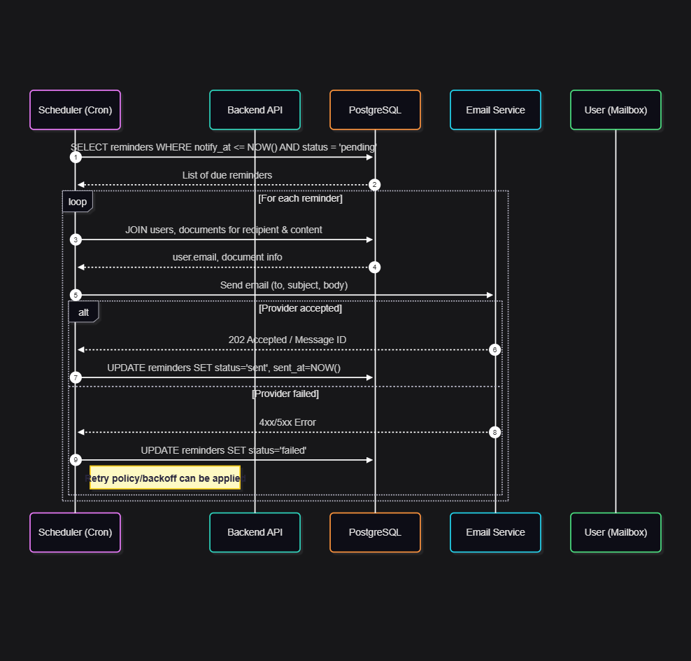

# Stage 3 – Technical Documentation  

## 3. High-Level Sequence Diagrams  

The following sequence diagrams illustrate the most critical interactions between the components of the **Expiry Tracker** system.  
These diagrams help visualize how the **Frontend**, **Backend**, **Database**, and **External Services** cooperate to provide a smooth user experience.  

---

### 1. User Login  

This sequence shows how a user logs into the system by submitting credentials, which are validated by the backend.  
If successful, the backend generates a **JWT token** that is returned to the frontend for authenticated requests.  

**Key steps:**  
1. User submits username and password in the login form.  
2. The Frontend sends credentials to the Backend API.  
3. Backend validates the credentials against the `users` table in PostgreSQL.  
4. If valid, the Backend generates a JWT and returns it to the Frontend.  
5. User is redirected to their Dashboard.  

  

---

### 2. User Adds a Document  

This sequence describes how a user saves a new document with its issue and expiry dates.  
The system stores this information in the database and confirms the addition.  

**Key steps:**  
1. User selects a category (exemple : Administration) and fills in document details.  
2. Frontend sends a `POST` request with the document data to the Backend.  
3. Backend validates the input and saves the document into the `documents` table.  
4. Backend responds with confirmation (success or error).  
5. Frontend updates the Dashboard to show the new document with its status.  

  

---

### 3. Email Reminder Notifications  
 
This sequence explains how the system automatically checks for upcoming expirations and sends reminder emails.  
It highlights the interaction between the Scheduler, Backend, Database, and the Email Service Provider.  

**Key steps:**  
1. The **Scheduler (cron job)** triggers a daily check.  
2. Backend queries the `documents` table for items expiring soon.  
3. For each expiring document, a new entry is added to the `reminders` table.  
4. Backend calls the external Email Service (SendGrid/Mailgun) with the reminder details.  
5. The Email Service delivers the reminder to the user’s inbox.  

  
